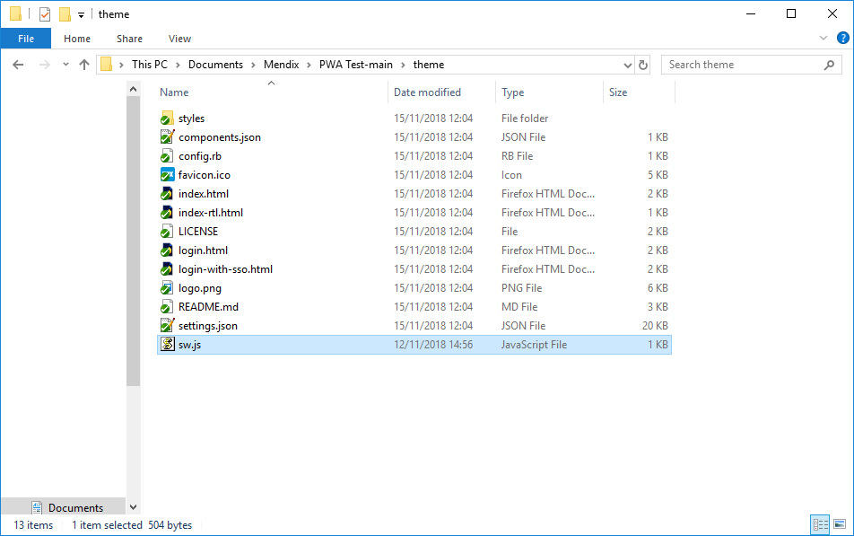

# Mendix-PWA-Example
Turn your Mendix Application into a Progressive Web App.

## Getting started
Download the packagefile and add it to your project.

### Getting your homepage ready
Make sure that your homepage has both JavaScript Snippets Widgets like in the `ExampleHome` page.

*The first Widget links to the Manifest file*

*The second Widget links to the Service Worker*

### Html headers
The first Widget adds headers to your page.
- The most important part is the Manifest link. 
- The theme-color decides the color of the address bar. 
- The favicon isn't mandatory.

### Manifest file
Set all the Manifest parameters in `CreateManifest`. This file decides the name, colors and Icons of your PWA.

### Installing the ServiceWorker

The second JavaScript Snippets Widget calls to the file `sw.js`. It's a ServiceWorker javascript file that you have to add manually.

- Create a new file called `sw.js`
- Add the file to your theme folder in the Mendix project
- Working example: https://github.com/madnessxd/Mendix-PWA-Example/blob/master/theme/sw.js

### It's time to run the application.
Send your application to the Sandbox or your Mendix Node. The pwa only works on a `https://` connection.

### Check your google Chrome tabs to see if everything works correctly

### Testing
Send your Application to the Sandbox and open your application with Chrome on Android:

### Changing the logos
- Upload your images to an `Image Collection` in Mendix.
- The url is [ModuleName$Imagename.filetype]
- For example: PWA$logo192.png
- Make sure to edit all the imagefiles in the Manifest through the `CreateManifest` microflow.

